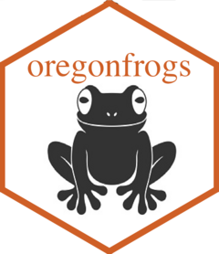
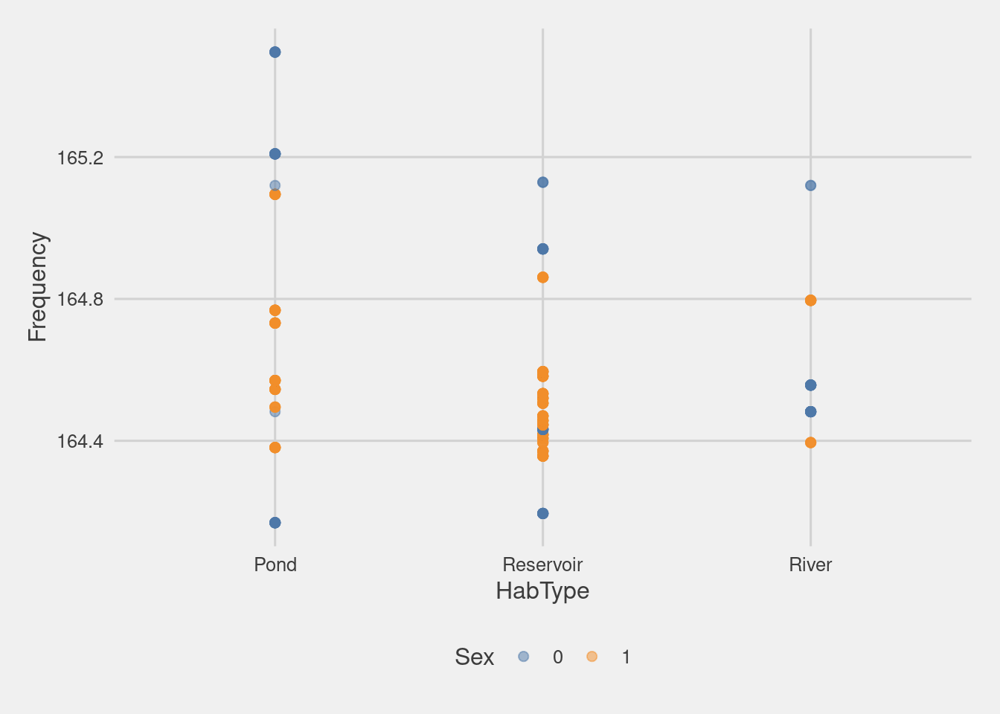

<!-- README.md is generated from README.Rmd. Please edit that file -->

# oregonfrogs <a href='https://fgazzelloni.github.io/oregonfrogs/'></a>

<!-- badges: start -->

[](https://zenodo.org/badge/latestdoi/526891877)
[](https://github.com/Fgazzelloni/oregonfrogs/actions/workflows/R-CMD-check.yaml)
<!-- badges: end -->

The goal of **oregonfrogs** is to provide a great dataset for data
exploration & visualization.

Original source of data is a **@USGS** study from Pearl, C.A., Rowe,
J.C., McCreary, B., and Adams, M.J., 2022. Geological Survey data
release: <https://doi.org/10.5066/P9DACPCV>.

## Installation

You can install the development version of **oregonfrogs** like so:

To install the development version from [GitHub](https://github.com/)
use:

``` r
# install.packages("remotes")
remotes::install_github("fgazzelloni/oregonfrogs")
```

## Example

This is a basic example which shows you how to load the package and
available data:

``` r
library(oregonfrogs)
data(package = 'oregonfrogs')
```

Let’s have a look at the dataset provided `oregonfrogs`.

``` r
head(oregonfrogs)
  detection survey_date doy      long      lat sex frequency interval subsite
1  Captured  2018-09-25 268 -121.7903 43.76502   0   164.169        0 SE Pond
2 No visual  2018-10-02 275 -121.7905 43.76503   0   164.169        1 SE Pond
3 No visual  2018-10-09 282 -121.7906 43.76477   0   164.169        2 SE Pond
4 No visual  2018-10-15 288 -121.7907 43.76483   0   164.169        3 SE Pond
5 No visual  2018-10-22 295 -121.7906 43.76479   0   164.169        4 SE Pond
6 No visual  2018-11-01 305 -121.7898 43.76470   0   164.169        5 SE Pond
  hab_type         water       type      structure         substrate    beaver
1     Pond    Deep water Marsh/Pond Herbaceous veg Unknown substrate No beaver
2     Pond    Deep water Marsh/Pond           Open Unknown substrate No beaver
3     Pond Shallow water Marsh/Pond Herbaceous veg Unknown substrate No beaver
4     Pond    Deep water Marsh/Pond   Woody debris Unknown substrate No beaver
5     Pond    Deep water Marsh/Pond      Woody veg Unknown substrate No beaver
6     Pond    Deep water Marsh/Pond Herbaceous veg Unknown substrate No beaver
```

For example we can use the package for making data visualization:



Please note that the **oregonfrogs** project is released with a
[Contributor Code of
Conduct](https://contributor-covenant.org/version/2/0/CODE_OF_CONDUCT.html).
By contributing to this project, you agree to abide by its terms.
